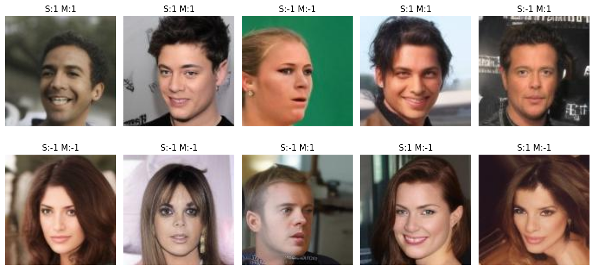
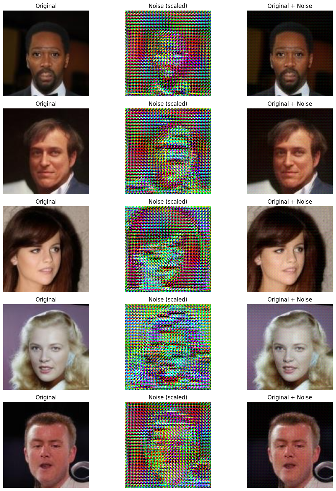
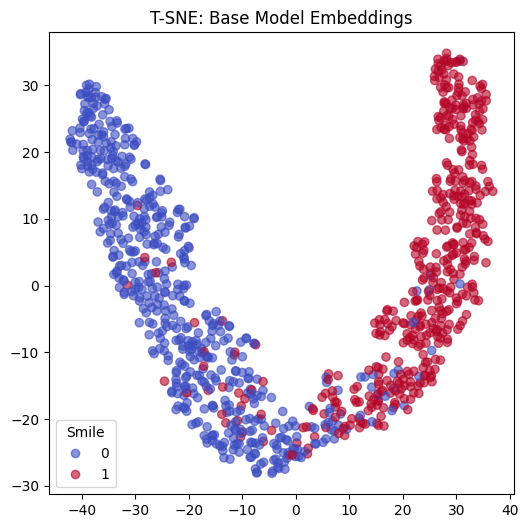
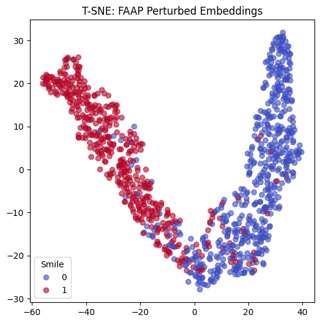

# Fairness-aware Adversarial Perturbation (FAAP)

This repository contains the implementation of the FAAP algorithm aimed at bias mitigation for deployed deep learning models without the need to retrain them. 

## Overview
The goal of this project is to reduce discrimination in an already trained model by applying fairness-aware adversarial perturbations to the input data. We use the **CelebA dataset** to train a model that predicts whether a person is `Smiling` (Target Attribute), while ensuring the model remains unbiased against `Gender/Male` (Sensitive Attribute).

### 1. Base Classifier
*   **Architecture:** ResNet-18 (used as a feature extractor) followed by a fully connected layer[cite: 78, 105].
*   **Task:** Binary classification of the 'Smiling' attribute.
*   **Performance:** ~89.65% clean accuracy on the test set[cite: 79].

### 2. FAAP Architecture
The FAAP framework consists of two main components trained adversarially:
*   **Generator (G):** A Convolutional-Deconvolutional network that adds bounded perturbations to the input image to hide the sensitive attribute while preserving the target prediction[cite: 79, 106].
*   **Discriminator (D):** A 2-layer MLP that tries to predict the sensitive attribute from the latent representations of the ResNet-18 model[cite: 80, 106].

---

## Sample Outputs

### CelebA Dataset Samples
Randomly selected samples displaying Target (S) and Sensitive (M) attributes:
<br>


### Adversarial Perturbation
Visualization of Original Image, Scaled Noise, and Original+Noise. The perturbations are quasi-imperceptible but successfully remove gender bias from the latent space:
<br>


### T-SNE Latent Space Visualization
Comparison of ResNet-18 embeddings before and after applying FAAP. The perturbed embeddings show tighter clustering around the decision hyperplane, indicating reduced leakage of sensitive information:
<br>
**Base Model:**

**FAAP Model:**


---

## Fairness Evaluation
By applying FAAP, both Demographic Parity (DP) and Equal Opportunity (EO) differences decreased, demonstrating enhanced fairness without compromising accuracy[cite: 82, 83, 107]:

| Model | Accuracy | DP diff | EO diff |
| :--- | :---: | :---: | :---: |
| **Base Model** | 0.896 | 0.153 | 0.099 |
| **FAAP Model** | 0.909 | 0.125 | 0.073 |

## Installation & Usage

1. Clone the repository:
```bash
git clone [https://github.com/yourusername/fairness-aware-adversarial-perturbation.git](https://github.com/yourusername/fairness-aware-adversarial-perturbation.git)
cd fairness-aware-adversarial-perturbation
